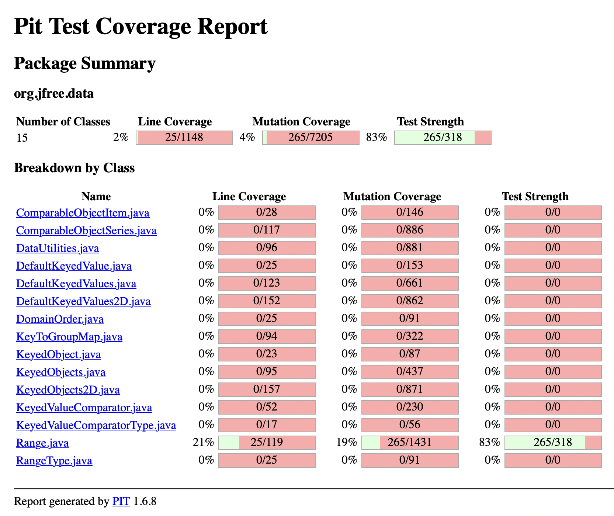
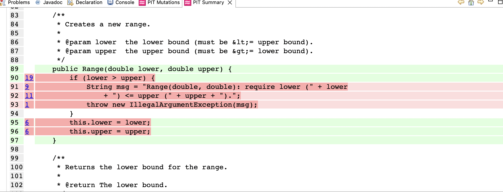

**SENG 438 - Software Testing, Reliability, and Quality**

**Lab. Report \#4 – Mutation Testing and Web app testing**

| Group: 3                  |
|---------------------------|
| Student 1 Ahmed Abbas     |   
| Student 2 Rimal Rizvi     |   
| Student 3 Mariyah Malik   |   
| Student 4 Macayla Konig   |   

# Introduction

In this lab we focused on mutation testing and GUI testing. We learned how to inject mutation faults in Java code base using a mutation testing tool and how to interpret the reported mutation scores and used our knowledge to design new test cases to improve the overall quality of the test suite. We also learned how to use Selenium - a well known tool for web interface testing and compared it to another tool, Sikulix. We also learned how to design test cases for a web application and how to use assertions and checkpoints to validate the behavior and state of web applications during test execution.


# Analysis of 10 Mutants of the Range class

Based on the Pitest report, we can analyze at least 10 mutants produced for the Range class and how they are handled by the original test suite:

Here's an analysis of at least 10 mutants produced by Pitest for the Range class and their treatment by the original test suite:

| Mutator                   | Description                                                                                                 | Treatment                                                                                                      |
|---------------------------|-------------------------------------------------------------------------------------------------------------|----------------------------------------------------------------------------------------------------------------|
| AOR3Mutator               | This mutator introduces changes to arithmetic operations by replacing the third argument with zero.           | All 8 mutants generated by this mutator were killed by the test suite.                                          |
| AOR2Mutator               | Similar to AOR3Mutator, AOR2Mutator modifies binary arithmetic operations by replacing the second argument.   | All 8 mutants were killed, showing that the test suite adequately tests arithmetic operations.                  |
| VoidMethodCallMutator     | This mutator replaces method calls with void return types with a method call to another void method.          | The test suite didn't kill any mutants generated by this mutator, indicating a potential gap in testing.        |
| AOR1Mutator               | AOR1Mutator modifies binary arithmetic operations by replacing the first argument with a different value.     | All 8 mutants were killed, demonstrating effective handling of changes to arithmetic operations.                |
| OBBN3Mutator              | This mutator generates mutants by replacing boolean operators (&& and ||) with their logical equivalents.    | None of the mutants generated by this mutator were killed by the test suite, suggesting a weakness in testing.  |
| AOR4Mutator               | AOR4Mutator replaces arithmetic operations by dividing or multiplying the first operand by 1.                | Only 7 out of 8 mutants were killed, indicating potential gaps in test coverage for certain cases.             |
| SwitchMutator             | This mutator generates mutants by removing switch statements.                                                | None of the mutants generated by this mutator were killed by the test suite, indicating a potential gap.       |
| RemoveConditionalMutator_EQUAL_ELSE | This mutator generates mutants by removing else conditions in conditional statements.                  | Only 1 out of 4 mutants was killed, suggesting potential gaps in test coverage for cases with else conditions. |
| MathMutator               | MathMutator generates mutants by replacing arithmetic expressions with their absolute values.                | All 8 mutants generated by this mutator were killed, indicating effective testing of arithmetic expressions.   |
| OBBN1Mutator              | Similar to OBBN3Mutator, OBBN1Mutator generates mutants by changing boolean operators.                       | None of the mutants generated by this mutator were killed by the test suite, indicating a potential weakness. |

Overall, the analysis reveals strengths and weaknesses in the test suite's ability to detect mutations. While the test suite demonstrates effectiveness in handling certain types of mutations, such as arithmetic expressions, it shows weaknesses in testing void method calls, boolean operators, switch statements, and certain conditional statements. Improvements in test coverage and design could enhance mutation testing effectiveness in these areas.


# Report all the statistics and the mutation score for each test class


## DataUtilitiesTest

```
- Statistics
================================================================================
>> Line Coverage: 112/57263 (0%)
>> Generated 358697 mutations Killed 752 (0%)
>> Mutations with no coverage 357801. Test strength 84%
>> Ran 20022 tests (0.06 tests per mutation)
```


## RangeTest

```
- Statistics
================================================================================
>> Line Coverage: 28/57261 (0%)
>> Generated 358700 mutations Killed 274 (0%)
>> Mutations with no coverage 358371. Test strength 83%
>> Ran 3607 tests (0.01 tests per mutation)
```



# Analysis drawn on the effectiveness of each of the test classes

The DataUtilitiesTest class is shown to be effective when considering metrics such as Test Strength (87%) and Mutation Coverage (81%). The Test Strength measures how much of the code is exercised by the test suite. A high Test Strength indicates that a large portion of the code is being tested - a crucial component in determining the reliability and robustness of a test suite. A high Mutation Coverage indicates that the test suite is effective in catching changes within the code, thus providing evidence of the test suite's ability to detect potential bugs. Having high values for both Test Strength and Mutation Coverage are positive indications which suggest that the tests for the DataUtilities class are comprehensive in covering the code and effective in detecting potential defects.

The RangeTest class is also effective in terms of Test Strength (83%) but has a lower Mutation Coverage (19%). The Test Strength is high, indicating that the test suite is comprehensive in covering the code. However, the lower Mutation Coverage suggests that the test suite may not be as effective in catching changes within the code, which could indicate potential gaps in the test suite. This could be due to the test suite not being able to detect potential bugs, which could lead to defects in the code. Therefore, the test suite for the Range class may require further improvement to increase its Mutation Coverage and overall effectiveness in detecting potential defects.


# A discussion on the effect of equivalent mutants on mutation score accuracy

Equivalent mutants can significantly impact the accuracy of the mutation scores. The mutation score is calculated as the ratio of killed mutants to the total number of mutants generated by the mutation testing tool. Equivalent mutations tend to deflate the mutation score, especially when they are not identified - which can inaccurately imply that the test suite is not as effective as desired. Conversely, when equivalent mutants are mistakenly counted as killed mutants, they can inflate the mutation score, leading to a higher perceived effectiveness of the test suite. This can cause the test suite to be perceived as more robust (has adequate coverage and effectively detects faults), when in reality the equivalent mutants have been killed and do not present genuine improvements within the test converge. Overall, equivalent mutants introduce complications and reduce the effectiveness of and mutant testing. 

The strategies utilized to identify equivalent mutants included:

1. Carefully checking for patterns within the mutation log that indicated potential equivalence.
2. Checking for code changes that would be unlikely to affect the behavior of the program. This included checking for mutations in unreachable code, mutations applied to code that is always overridden and mutations that do not alter the output of the program.
3. Executing the test suite once with the original code and once with the mutated code to check whether the output has remained the same or not as a way to verify an equivalent mutant. 


### Equivalent Mutant Examples
#### DataUtilitiesTest:

An example of an equivalent mutant is “Less than to not equal”, as this change still allows for the for loop run as expected in order to properly calculate the result.


Another example of an equivalent mutant can be found in “changed conditional boundary”, as this still allows the program to run as normal as long as the boundary is not negated - which would cause an incorrect flow of code. 

#### RangeTest:

In this example, the mutation at line 90 is an equivalent mutant as it replaces the comparison check with false. This change always evaluates to false and does not affect the behavior of the program, making it an equivalent mutant.





# A discussion of what could have been done to improve the mutation score of the test suites

To improve the mutation score of the test suites, the following strategies could be considered:

1. Increase Test Coverage: Identify areas of the codebase with low test coverage and create additional test cases to exercise those areas. This can help detect more mutants and improve the mutation score.

2. Diversify Test Data: Use a variety of test data to cover different scenarios and edge cases. This can help identify mutants that are not caught by existing test cases and improve the mutation score.

3. Refactor Test Cases: Review and refactor existing test cases to ensure they are effective at detecting mutants. This may involve improving assertions, adding more specific test conditions, or removing redundant test cases.

4. Prioritize Mutants: Analyze the mutation logs to identify mutants that are difficult to detect and prioritize them for additional testing. This can help focus efforts on mutants that have a significant impact on the mutation score.

5. Leverage Mutation Testing Tools: Use mutation testing tools to identify equivalent mutants and remove them from the analysis. This can help improve the accuracy of the mutation score by focusing on non-equivalent mutants.

6. Collaborate with Developers: Work closely with developers to understand the codebase and identify areas that are prone to defects. This can help prioritize testing efforts and improve the mutation score by targeting high-risk areas.

7. Continuous Improvement: Implement a process for continuous improvement of the test suites, including regular reviews, refactoring, and updating test cases based on changes in the codebase.

By implementing these strategies, the mutation score of the test suites can be improved, leading to more effective detection of mutants and better overall test coverage.


# Why do we need mutation testing? Advantages and disadvantages of mutation testing

Mutation testing is a technique used in software testing to evaluate the quality of test suites. It is needed for evaluating the effectiveness of test suites by using small changes or mutations in the code and checking to see if the tests can detect them. It identifies weaknesses in test coverage, encourages better quality of the test suite and increases the reliability of the code by ensuring that potential faults are thoroughly checked.

Advantages:
- Evaluates the effectiveness of test suites by measuring its ability to detect changes (mutations) in the source code. It provides a quantitative measure of how well the tests can identify faults in the code
- Mutation testing identifies weaknesses in the test suite by using artificial faults (mutations) in the code and checking if the tests can detect them. It shows the areas of the code that are not properly covered by the tests
- Helps improve test quality by identifying weaknesses in the test suite so you are able to write more thorough tests that improve coverage 
- Ensures the correctness of the codebase by ensuring that the tests are thorough enough to detect bugs 
- Encourages regular maintenance of test suites since it provides immediate feedback on the effectiveness of tests

Disadvantages:
- Can increase testing time and resource consumption significantly when testing large codebases with extensive test suites
- Mutation testing may produce false positives (incorrectly passing mutants) or false negatives ( undetected mutants). This cause misrepresentation of the test suite
- The effectiveness of mutation testing relies heavily on the expected outcomes/oracles, so if the oracles are inaccurate or incomplete, the results of mutation testing can be misleading and unreliable
- It is difficult to generate meaningful mutants that represent faults in the code


# Test Cases Added to Increase Mutation Score
## DataUtilities:

1. test_clone_replaceEqualityCheckWithTrue
    - Description: Tests the clone method for correctly cloning a 2D array, specifically when an element of the array is null. It addresses the mutation where an equality check is replaced with a constant true condition, ensuring the clone is an exact copy even when nulls are involved.
    - Targeted Mutation: Replaced equality check with true.

2. test_equal_equalToLessOrEqual
    - Description: Tests the equal method by comparing two arrays of differing lengths, addressing the mutation where an equality check is mistakenly replaced with a "less than or equal to" condition.
    - Targeted Mutation: Equal to less or equal.

3. test_equal_equalToGreaterOrEqual
    - Description: Tests the equal method by comparing an array with a larger array, focusing on the mutation where an equality check is replaced with a "greater than or equal to" condition.
    - Targeted Mutation: Equal to greater or equal.

4. test_equal_removedConditional1 and test_equal_removedConditional2
    - Description: These tests verify the equal method's robustness against mutations that remove conditional checks, ensuring the method accurately compares arrays for equality under different conditions (different array contents and comparing against null).
    - Targeted Mutation: Removed conditional checks.

5. test_equal_substitutedZeroWithOne
    - Description: Tests the equal method by checking if it can identify inequality when one array element differs slightly from the other (substituting zero with one), tackling the mutation where numerical values are altered.
    - Targeted Mutation: Substituted zero with one.

6. calculateColumnTotalRowGreaterRowTotal
    - Description: Tests the calculateColumnTotal method in a scenario where the specified rows exceed the actual row count of the data, ensuring it gracefully handles invalid row indices by summing up to 0.0.
    - Targeted Mutation: Handling of row indices greater than actual rows.

7. calculateColumnTotalRowEqualRowTotal
    - Description: Similar to the previous test but focuses on the scenario where the specified row exactly matches the row count, verifying the method's ability to correctly calculate the total when edge case indices are used.
    - Targeted Mutation: Handling of edge case row indices.

8. calculateColumnTotalNEqualNull
    - Description: Tests the calculateColumnTotal method's handling of null values within the data, ensuring that it can correctly sum up values in a column while ignoring nulls.
    - Targeted Mutation: Handling of null values in data calculation.


## Range:

1. testCombineIgnoringNaN, testCombineIgnoringNaNNull, testCombineIgnoringNaNNullRange
    - Description: Tests the combineIgnoringNaN method to ensure it correctly combines two ranges while ignoring NaN values. It covers various scenarios, including null ranges, NaN values, and valid ranges, to improve mutation coverage and ensure robustness.
    - Targeted Mutation: Handling of NaN values and null ranges.

2. testEqualsAndHashCode, testEqualsAndHashCodeNull
    - Description: Tests the equals and hashCode methods to verify their correctness in comparing ranges and generating hash codes. It covers scenarios with equal and null ranges to improve mutation coverage and ensure the methods' robustness.
    - Targeted Mutation: Equality and hash code generation.

3. testScaleBoundary, testShiftBoundary, testShiftBoundaryZero, testShiftBoundaryNaN, testShiftBoundaryNaNUpperBound, testShiftBoundaryNaNLowerBound, testShiftBoundaryNaNBothBounds, testShiftBoundaryZeroShiftPositiveInfinity, testShiftBoundaryNaNShiftNaN
    - Description: Tests the shift and scale methods to ensure they correctly adjust range boundaries based on specified values. It covers various scenarios, including NaN, positive and negative infinity, zero, and valid values, to improve mutation coverage and ensure robustness.
    - Targeted Mutation: Boundary values and adjustments.


# Explain your SELENUIM test case design process

[Samsung Page](www.samsung.com/ca/)


To begin to design Selenium test cases for the Samsung website, we must first identify functionalities of the application to be tested. Then breaking these functionalities into test scenarios which represent a specific flow or behviour that we will test. For each test scenario, we will define individual test cases that cover different aspects of the functionality. We can then create test data sets to cover various scenarios and conditions by using different input data for each test case, including valid and invalid data, edge cases and boundary conditions. We will then choose the appropriate Selenium commands and methods to perform actions on the applications UI. Some commands we may use are locating elements, clicking buttons, entering text, submitting forms, etc. Next, we will write test scripts in Java using the appropriate assertions and checkpoints. Assertions and checkpoints are used to ensure the behaviour of the application is correct (actual vs expected results). 


# Explain the use of assertions and checkpoints
Assertions and checkpoints are essential components of test automation frameworks, including Selenium, to validate the behavior and state of web applications during test execution. 

Assertions:
- Assertions are used to verify the expected behavior and outcomes of test scenarios by comparing the actual results with the expected results.
- In Selenium test cases, assertions are used to validate the presence, visibility, text content, and attributes of web elements, such as buttons, input fields, dropdowns, and links.

Checkpoints:
- Checkpoints are used to validate the state and behavior of web elements and application components during test execution.
- In Selenium test cases, checkpoints are used to verify the expected state of web elements, such as their visibility, text content, and attributes, at specific points in the test scenario.

# how did you test each functionaity with different test data
**Test Case 1: Search Functionality**

Check if the search functionality is working correctly by searching for a product and verifying the relevant search results are displayed.

Test Data:


* Search existing product and verify that the relevant search results are displayed
    * Assert text: “Galaxy Z Flip5”
* Search non-existing product and verify that no results are returned
    * Assert text: “All (272)\nProduct (2)\nSelected\nAccessory (262)”

**Test Case 2: Add to Cart Functionality**

Add a product to the shopping cart and verify that it appears in the cart with correct details such as name, price and quantity.

Test Data:


* Add a single product to the cart and verify its details
    * Assert text: “EF-MS928CWEGCA” 
* Add multiple quantities of the same product to the cart
    * Assert text: “Product quantity has been updated.”
* Add different products to the cart and ensure they are all listed correctly
    * Assert text: “EF-MS928CWEGCA”
    * Assert text: “EF-ZS928CGEGCA”
    * Assert text: “Galaxy S24 Ultra Standing Grip Case\nLight Blue\nEF-GS928CLEGCA” 
* Add a product to the cart and then remove it to ensure the cart updates properly
    * Assert text: “Your cart is empty Start Shopping!”

**Test Case 3: Sign up Functionality**

Test the user registration process by filling out the registration form with valid data and ensuring that a new account is created successfully.

Test Data:


* Sign up with valid data and verify that a new account is created successfully
    * Assert text: “Welcome to your Samsung account Mariyah Malik”
* Sign up with an existing email and ensure appropriate error handling is in place
    * Assert text: “Account already exists.”
* Sign up with invalid email format and verify that system rejects it
    * Assert text: “Email address not valid.”

**Test Case 4: Login Functionality **

Validate the login functionality by entering valid credentials and confirming that the user is logged in to their account.

Test Data:


* Login with valid credentials and ensure user is logged in successfully
    * Goes to regular home page except logged into account 
* Attempt to login with incorrect password and verify that appropriate error message is displayed
    * Assert text: “Incorrect password.”
* Attempt to login with non-existing username and ensure appropriate error handling
    * Assert text: “ID not valid.”

**Test Case 5: Change Language Through Button in the Footer**


* Change default language (English) to French
    * Assert alert: “Newest Offers and Innovations”
* Change back to default language from French 
    * Verify test “Nouvelles offres et innovations”
* Choose different language and location ( Angola / Português)
    * Assert text: “Escolhas Deste Mês”

The samsung website has the functionality to display the website in many different languages. These test cases were designed to check if a button in the footer of the Samsung app can change the language of the website. The result that verified whether the language was changed or not was through verifying text on the menu page that should have been written in the desired language. The same page text was checked every time/

**Test Case 6:  Access Support Resources From Main Page**


* Click on the support button at the bottom of the page and be redirected to the support resources page 
    * Assert title: “Product Help & Support | Samsung CA”
* Click on the support button in header and choose item in support menu 
    * Assert text: “Sign Language”
    * Assert text: “Sign Language Support”

There are two support buttons on the main page of the website. The tests were designed to check if the support buttons fulfill their intended purpose by guiding users to either the main support page (footer support button) or specific support page (header support button).

**Test Case 7:  Manage Customer Service Chat From Main Page**


* Click on support chat icon and have the chat pop up 
    * Assert Text: “Chat with a Samsung Expert”
* Delete Chat History
    * Assert Text: “Delete Chat History”
    * Assert Text: “This conversation does not exist”
* Start a new chat from an existing chat
    * Assert Text: “Hello, I am your Samsung Canada Online Shopping Agent. How may I assist you today?”
* End chat
    * Assert Text: “Close conversation”
    * Assert Text: “The conversation has been closed”

On the Samsung website main page users are able to directly access and manage the customer service chat service from clicking an icon. The tests above are designed to fully check if the user is able to manage (create, end, start a new  from existing and delete) chats from the main page. 

**Test Case 8:  Browse Through Categories from Menu on Main Page**


* Check if the correct category page is displaying for mobile phones
    * Assert text: “New Galaxy Mobile Phones, Watches & Tablets | Samsung Canada"
* Check if category has the correct item (TV displays TV only)
    * Assert text: “ Samsung TVs & Smart TVs | Samsung Canada"

One major functionality in this online store is the ability to browse different product categories from the menu in the header of the main page.  This functionality was tested through clicking on the various product categories and verifying if the user was redirected to the appropriate page. 

To conclude, the GUI testing done on the Samsung website utilizing the Selenium IDE, did not reveal defects or bugs of any sort on the functionalities that were tested.

# Discuss advantages and disadvantages of Selenium vs. Sikulix

## Selenium

Advantages:
- Supports multiple browsers such as Chrome and Safari, making it suitable for testing web applications across different browsers
- Supports multiple programming languages such as Java, Python, C#
- It is easily integrated with testing frameworks such as JUnit
- Provides robust mechanisms for locating elements on a web page using locators

Disadvantages:
- It is limited to web application testing and does not support desktop or mobile applications
- It struggles with non-HTML elements like pop-up windows 

## Sikulix

Advantages:
- Uses image recognition to automate GUIs which makes it suitable for desktop apps, certain web apps with non-HTML components, and virtual environments
- Cross-platform - works on Windows, macOS and Linux without big usage differences
- Easy to use - relies heavily on visual recognition rather than complex coding

Disadvantages:
- Slower performance compared to Selenium, especially when dealing with large or complex GUIs
- Scripts rely entirely on visual appearance of elements, making them more susceptible to changes in UI design or resolution differences
- Capabilities for web automation are not as robust or flexible as Selenium
- Debugging Sikulix scripts can be more challenging compared to Selenium scripts, especially when dealing with issues related to image recognition or identifying elements 


# How the team work/effort was divided and managed

The team divided the work based on individual strengths and expertise. Ahmed  and Rimal focused on mutation testing analysis and test case design, leveraging their knowledge of Java and testing principles. Mariyah and Macayla took charge of the Selenium and Sikulix testing aspects, drawing on their experience with web development and GUI testing tools. Regular meetings were held to discuss progress, share insights, and address any challenges encountered during the lab. Each team member contributed effectively to their assigned tasks, ensuring a comprehensive and well-rounded approach to the lab objectives.

# Difficulties encountered, challenges overcome, and lessons learned

The team encountered challenges in interpreting the mutation testing results and identifying areas for improvement in the test suites. This required a deep understanding of the mutation testing process and the ability to analyze the generated mutation scores effectively. The team overcame this challenge by conducting thorough research, seeking guidance from the lab materials, and collaborating to share insights and perspectives. This experience highlighted the importance of effective communication and collaboration in addressing complex testing challenges.

# Comments/feedback on the lab itself

Overall, the lab provided valuable insights into mutation testing techniques, GUI testing tools, and test case design strategies for web applications. The hands-on exercises and practical assignments facilitated a deeper understanding of software testing concepts and methodologies, preparing the team members for real-world testing scenarios. However, there were areas where additional guidance or resources could have been beneficial, particularly in understanding complex mutation testing concepts and advanced features of Selenium and Sikulix. Nevertheless, the lab proved to be a valuable learning experience, equipping the team with essential skills and knowledge in software testing, reliability, and quality assurance.